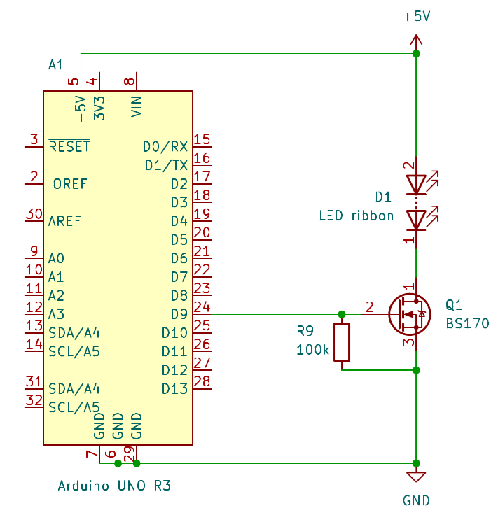
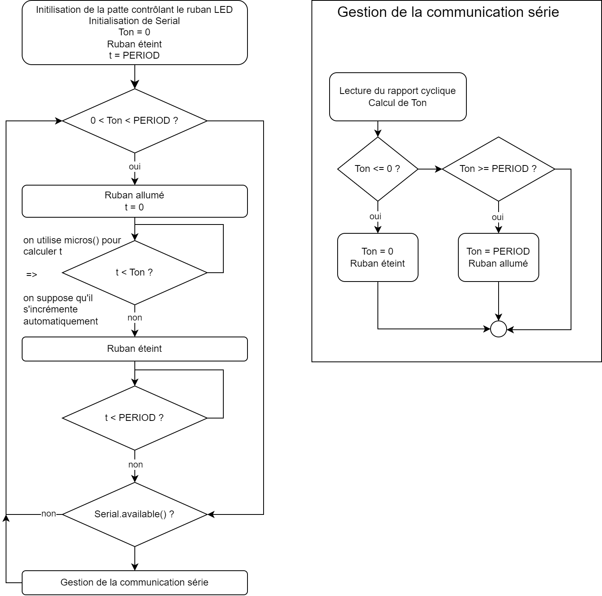

# testRuban

Code permettant de tester le fonctionnement du circuit de conmmande du ruban LED.

L'*Arduino* contrôle l'intensité lumineuse du ruban en utilisant la [*Pulse Width Modulation*](https://docs.arduino.cc/learn/microcontrollers/analog-output).  
Pour obtenir des timings précis, on utilise le fonction *micros()*, qui donne le temps écoulé depuis le début du programme.  Cela permet de s'affranchir du temps d'exécution de la boucle principale, contrairement à la fonction *delay()*.  
On peut modifier l'intensité lumineuse en utilisant le moniteur série de l'*IDE* Arduino.

## Schéma du montage

La patte D9 de l'[*Arduino UNO*](https://docs.arduino.cc/hardware/uno-rev3) commande un transistor qui agit comme un interupteur placé en série avec le [ruban LED](https://docs.rs-online.com/6bb2/0900766b816d5c11.pdf).  
Celui-ci est alimenté par la sortie **5V** de l'Arduino, qui est alimenté par son port USB (nécessaire à la communication série).  
La résistance **R9** est une résistance de *pull-down* pour que le transistor soit ouvert par défaut.

## Flowchart

# Comportement attendu

les LED doivent clignoter à 1kHz (trop rapide pour l'oeil humain). Le rapport cyclique vaut 0%, les LED doivent rester étentes.
L'Arduino doit envoyer un message au moniteur série de l'IDE Arduino (baudrate 9600).
En envoyant une valeur entre 0 et 100%, on peut faire varier l'intensité lumineuse des LED.
On peut aussi observer le signal sur le D9 à l'oscilloscope : on doit voir une onde en créneau à 1kHz, dont le rapport cyclique change en fonction de la valeur envoyée.

# Problèmes et améliorations possibles

## test du 20/09/2024

Le circuit a été Montage du circuit sur protoboard.
Le dispositif fonctionne correctement.
Rien à signaler.
